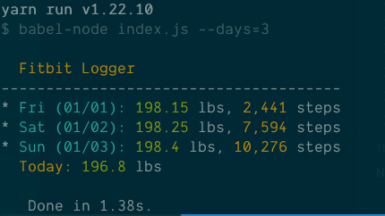

# Fitbit Logger

I track my weight and activity using my Fitbit: this is a simple reporting script that lets me very quickly get a report of the stats that are relevant to me to copy/paste into an email to my fitness coach.

# How to use it

`yarn` or `npm i`

You'll need to create an app for yourself using Fitbit's developer portal. (This is set up as a personal-use convenience script!) Then you should use the [oauth tutorial](https://dev.fitbit.com/apps/oauthinteractivetutorial) to generate four files:

- .client_id
- .client_secret
- .access_token
- .refresh_token

Once you've one this for the first time, the script should be able to take care of all future token refreshing on its own.

Then just run the main script:

`yarn start [--days=1]`

The days argument tells the script how far back in time to go for its report.

